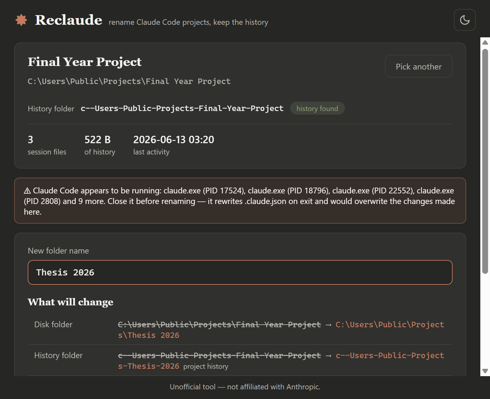

# Reclaude

A small Windows desktop app that renames Claude Code project folders **without losing chat history**.

> Unofficial tool — not affiliated with Anthropic.



## The Problem

Claude Code stores a project's chat history not in the project folder, but in
`%USERPROFILE%\.claude\projects\<ENCODED>`, where `<ENCODED>` is derived from the project's
absolute path (every non-alphanumeric character becomes a dash, drive letter lowercased).
Rename the folder in Explorer and Claude shows an empty chat — the history isn't deleted,
just orphaned.

Reclaude performs the rename the safe way, keeping four things in sync:

1. The real project folder on disk.
2. The encoded history folder under `%USERPROFILE%\.claude\projects\` (which also holds per-project memory).
3. Path references inside `%USERPROFILE%\.claude.json` (literal text replacement, all four path spellings, sibling-safe).
4. Optionally (default on), the old path embedded in every session `.jsonl` file, so resumed sessions reference the new path.

It backs everything up first (last 5 backup sets kept under `%LOCALAPPDATA%\Reclaude\backups`),
rolls back automatically if any step fails, and offers **Undo last rename**.

Scope: native Windows Claude Code only (not WSL).

## Why Tauri

Tauri v2 was chosen over the C# WinForms fallback: the web UI makes the Claude-style theme
(dark/light, serif headings, diff-styled preview) straightforward, the exe stays small
(~6 MB), and WebView2 ships with Windows 11 and effectively all updated Windows 10 machines,
so the built exe runs by double-click with no runtime install.

## Prerequisites (Build Only)

- **Rust toolchain** (stable, MSVC target) — install via [rustup](https://rustup.rs)
- **Visual Studio Build Tools** with the *Desktop development with C++* workload
- **Node.js** (only used to run the Tauri CLI and generate the icon)

End users need none of these — just the exe (WebView2 is preinstalled on Win 11 / updated Win 10).

## Build

```powershell
npm install                          # installs @tauri-apps/cli
node scripts/gen-icon.mjs            # (re)generate the icon PNG, only needed once
npx tauri icon scripts/icon-1024.png # (re)generate .ico + pngs, only needed once
npx tauri build                      # release build
```

The final exe lands at:

```
src-tauri\target\release\Reclaude.exe
```

It's fully standalone — copy it anywhere and double-click.

An "installed" copy lives at `%LOCALAPPDATA%\Programs\Reclaude\Reclaude.exe`, which the
Start Menu shortcut (and therefore Windows Search) points to. After a rebuild, refresh it
with `npm run install-app` (build + copy) or `node scripts/install.mjs` (copy only).

For development with hot reload of the frontend: `npx tauri dev`.

Note: `Cargo.lock` pins the transitive `time` crate to 0.3.47 — `time` 0.3.48 currently
fails to compile against `cookie` 0.18 (E0119). If you regenerate the lockfile and hit that
error, run `cargo update time --precise 0.3.47` inside `src-tauri`.

## Tests

Unit tests cover the core logic (path encoding, sibling-safe replacement, name validation),
and an integration test drives the whole pipeline — rename, rollback on forced failure,
undo, case-only rename — against a sandboxed fake `%USERPROFILE%`:

```powershell
cd src-tauri
cargo test
```

After building, `node scripts/smoke.mjs` launches the real exe and exercises the UI + IPC
end to end via WebView2 remote debugging; `node scripts/screenshot.mjs` captures screenshots
of the running app.

## How the Rename Works

Execution order is chosen so the step most likely to fail (a locked folder) happens first,
and every later step can be rolled back:

1. Back up `.claude.json` and zip the affected session files.
2. Rename the real folder (two-step via a temp name for case-only renames).
3. Rename the encoded history folder(s) — including verified nested projects when you rename a parent folder.
4. Literal, sibling-safe text replacement in `.claude.json` (never re-serialized; UTF-8 without BOM preserved).
5. Deep-fix the `.jsonl` session files.

A `rename-manifest.json` under `%LOCALAPPDATA%\Reclaude` records everything for Undo.

The sibling-name trap: replacing `...\Final Year Project` must not touch
`...\Final Year Project 2`. Replacements only apply when the match is followed by `"`,
`/` or `\`, and ambiguous encoded folders are verified against the `cwd` recorded in their
newest session file — unverifiable folders are listed and left alone.

## License

[MIT](LICENSE)
