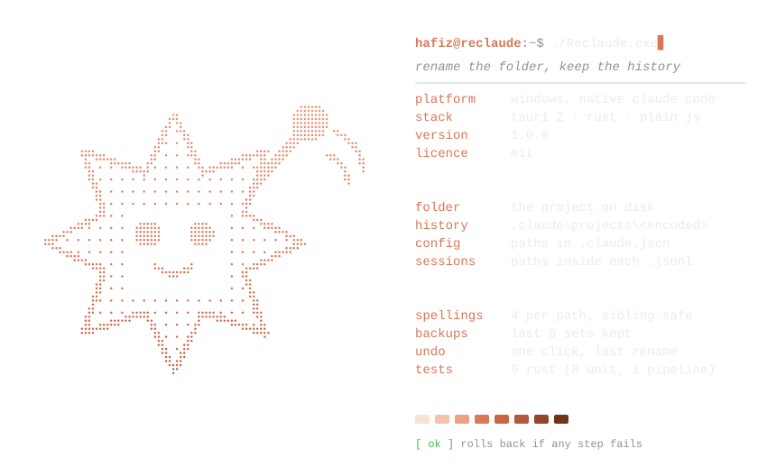
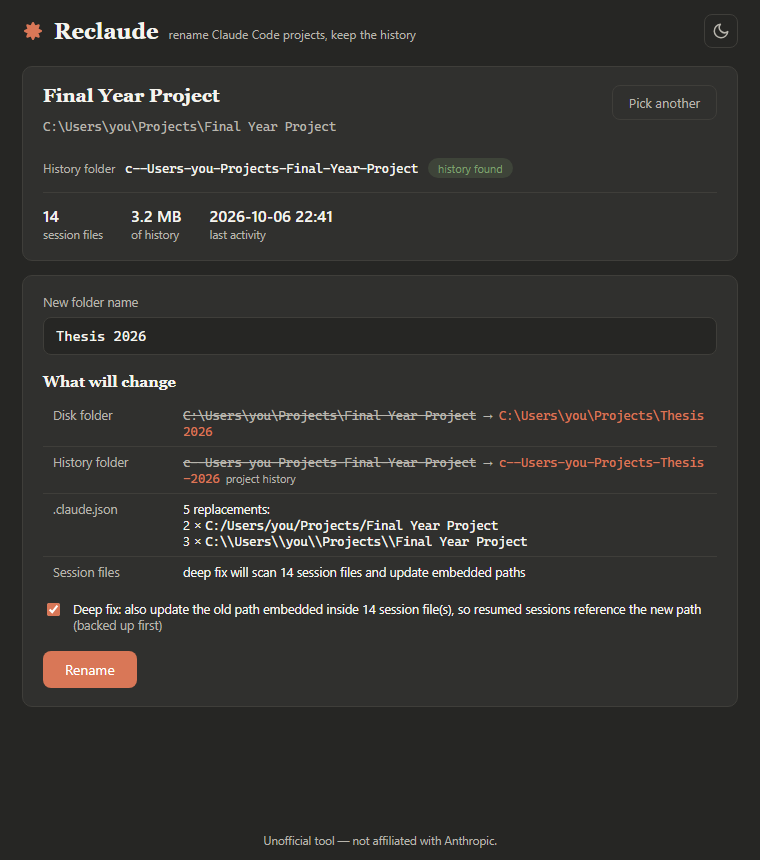
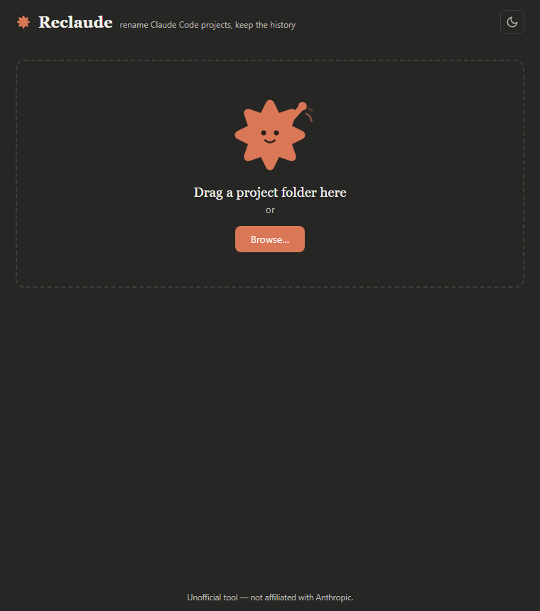
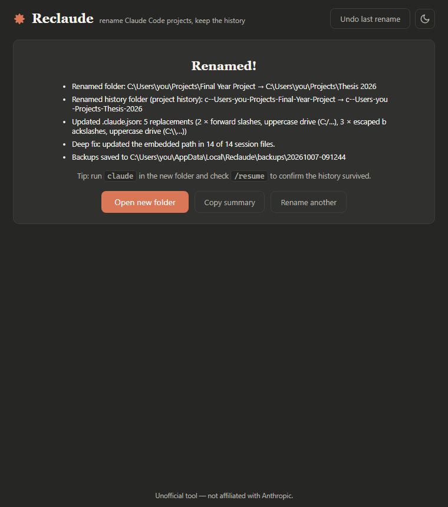

<div align="center">
  <picture>
    <source media="(prefers-color-scheme: dark)" srcset=".github/readme/banner-dark.svg">
    <source media="(prefers-color-scheme: light)" srcset=".github/readme/banner-light.svg">
    
  </picture>
</div>

<div align="center">
  <picture>
    <source media="(prefers-color-scheme: dark)" srcset=".github/readme/card-dark.svg">
    <source media="(prefers-color-scheme: light)" srcset=".github/readme/card-light.svg">
    
  </picture>
</div>

<p align="center">
  <a href="#hafizreclaude-npx-tauri-build"></a>
  <a href="LICENSE"></a>
  <a href="#hafizreclaude-man-rename"></a>
</p>

> Unofficial tool, not affiliated with Anthropic.

```text
hafiz@reclaude:~$ cat ./about
a small windows desktop app that renames claude code project folders
without losing your chat history.

hafiz@reclaude:~$ grep -c "#\[test\]" src-tauri/src/logic.rs src-tauri/tests/pipeline.rs
src-tauri/src/logic.rs:8
src-tauri/tests/pipeline.rs:1
```

### <samp>hafiz@reclaude:~$ ./Reclaude.exe</samp>

<p align="center">
  <picture>
    <source media="(prefers-color-scheme: dark)" srcset=".github/readme/shots/preview-dark.png">
    <source media="(prefers-color-scheme: light)" srcset=".github/readme/shots/preview-light.png">
    
  </picture>
</p>

<table>
  <tr>
    <td width="50%"><samp>pick a folder</samp></td>
    <td width="50%"><samp>renamed, with a summary and undo</samp></td>
  </tr>
  <tr>
    <td>
      <picture>
        <source media="(prefers-color-scheme: dark)" srcset=".github/readme/shots/pick-dark.png">
        <source media="(prefers-color-scheme: light)" srcset=".github/readme/shots/pick-light.png">
        
      </picture>
    </td>
    <td>
      <picture>
        <source media="(prefers-color-scheme: dark)" srcset=".github/readme/shots/result-dark.png">
        <source media="(prefers-color-scheme: light)" srcset=".github/readme/shots/result-light.png">
        
      </picture>
    </td>
  </tr>
</table>

<sub>The real frontend (<code>src/</code>) in a browser, dark and light, with the Tauri backend swapped for a stub that returns sample data. Nothing was renamed and the paths are made up.</sub>

### <samp>hafiz@reclaude:~$ cat ./problem</samp>

Here's the annoying part. Claude Code doesn't keep a project's chat history in
the project folder. It keeps it in `%USERPROFILE%\.claude\projects\<ENCODED>`,
where `<ENCODED>` is built from the project's absolute path (every
non-alphanumeric character becomes a dash, and the drive letter gets
lowercased). So the moment you rename the folder in Explorer, Claude opens to an
empty chat. The history isn't gone, it's just orphaned, pointing at a path that
no longer exists.

Reclaude does the rename properly and keeps four things in sync:

| | what | how |
|:-:|:--|:--|
| 1 | The real project folder on disk | Renamed right after the backup; case-only renames go through a temp name |
| 2 | The encoded history folder under `%USERPROFILE%\.claude\projects\` | Also where per-project memory lives |
| 3 | Path references inside `%USERPROFILE%\.claude.json` | Literal text replacement, all four path spellings, siblings untouched |
| 4 | The old path baked into every session `.jsonl` file | Optional, on by default, so resumed sessions point at the new path too |

Everything gets backed up first (it keeps the last 5 backup sets under
`%LOCALAPPDATA%\Reclaude\backups`), it rolls back automatically if any step
fails, and there's an **Undo last rename** button for when you change your mind.

Scope: native Windows Claude Code only, not WSL.

### <samp>hafiz@reclaude:~$ man rename</samp>

The execution order is deliberate. The step most likely to fail (a locked
folder) happens first, and every step after it can be rolled back:

```text
RENAME(7)

  1. backup    back up .claude.json and zip the affected session files
  2. folder    rename the real folder (case-only renames take two steps
               through a temp name)
  3. history   rename the encoded history folder(s), including verified
               nested projects when you rename a parent folder
  4. config    literal, sibling-safe text replacement in .claude.json
               (never re-serialized; UTF-8 without BOM is preserved)
  5. sessions  deep-fix the .jsonl session files
```

A `rename-manifest.json` under `%LOCALAPPDATA%\Reclaude` records all of it for
Undo.

Then there's the sibling-name trap, which is the whole reason this is fiddly:
renaming `...\Final Year Project` must not touch `...\Final Year Project 2`. So
replacements only fire when the match is followed by `"`, `/`, or `\`, and any
ambiguous encoded folders are verified against the `cwd` recorded in their
newest session file. Anything that can't be verified is listed and left alone.

### <samp>hafiz@reclaude:~$ cat ./why-tauri</samp>

I went with Tauri v2 over a C# WinForms fallback for a few reasons. The web UI
makes the Claude-style theme (dark and light, serif headings, diff-styled
preview) easy to build, the exe stays tiny (about 6 MB), and WebView2 already
ships with Windows 11 and basically every updated Windows 10 machine. That last
part is what matters most: the built exe just runs on a double-click, no runtime
to install.

### <samp>hafiz@reclaude:~$ npx tauri build</samp>

To build it you need:

- **Rust toolchain** (stable, MSVC target), installed via [rustup](https://rustup.rs)
- **Visual Studio Build Tools** with the *Desktop development with C++* workload
- **Node.js**, only used to run the Tauri CLI and generate the icon

End users don't need any of this. They just need the exe (WebView2 is already on
Windows 11 and updated Windows 10).

```powershell
npm install                          # installs @tauri-apps/cli
node scripts/gen-icon.mjs            # (re)generate the icon PNG, only needed once
npx tauri icon scripts/icon-1024.png # (re)generate .ico + pngs, only needed once
npx tauri build                      # release build
```

The final exe lands at:

```text
src-tauri\target\release\Reclaude.exe
```

It's fully standalone, so copy it anywhere and double-click.

There's also an "installed" copy at
`%LOCALAPPDATA%\Programs\Reclaude\Reclaude.exe`, which is what the Start Menu
shortcut (and therefore Windows Search) points to. After a rebuild, refresh it
with `npm run install-app` (build + copy) or `node scripts/install.mjs` (copy
only).

For development with hot reload of the frontend, run `npx tauri dev`.

One gotcha: `Cargo.lock` pins the transitive `time` crate to 0.3.47, because
`time` 0.3.48 currently fails to compile against `cookie` 0.18 (E0119). If you
regenerate the lockfile and hit that error, run
`cargo update time --precise 0.3.47` inside `src-tauri`.

### <samp>hafiz@reclaude:~$ cargo test</samp>

Unit tests cover the core logic (path encoding, sibling-safe replacement, name
validation), and an integration test drives the whole pipeline (rename, rollback
on forced failure, undo, case-only rename) against a sandboxed fake
`%USERPROFILE%`:

```powershell
cd src-tauri
cargo test
```

After building, `node scripts/smoke.mjs` launches the real exe and exercises the
UI and IPC end to end via WebView2 remote debugging, and
`node scripts/screenshot.mjs` captures screenshots of the running app.

### <samp>hafiz@reclaude:~$ cat LICENSE</samp>

[MIT](LICENSE)

<sub>The banner and card are generated by <code>.github/readme/build.py</code> (standard library Python). Change a value at the top and run it again.</sub>
